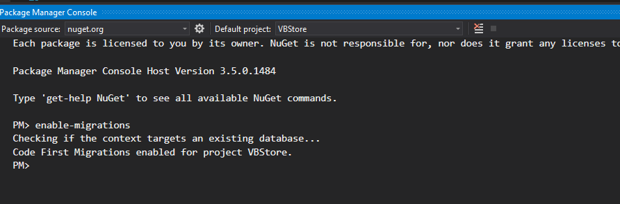
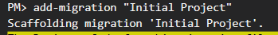
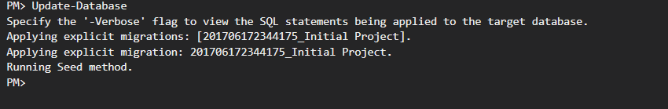

# Step By Step Guide

## Create Site See [Create site issue](https://github.com/VBDev2Dev/VBStore/pull/3)
1. Create ASP.Net MVC site    
1. Choose bootstrap theme and update bootstrap files with new css files.  I chose [Cyborg from bootswatch](https://bootswatch.com/cyborg/)

## Setup Migrations
1. Enable migrations.  This will let us use code first migrations. Read about them [here]() 
1. Add initial migration. 
1. Update web config to have database names desired.

## Setup Roles
1. Add default role seeding to create the roles if needed.
1. Run update-database to apply code migrations and get roles in db.
1. Add new users to default role.
