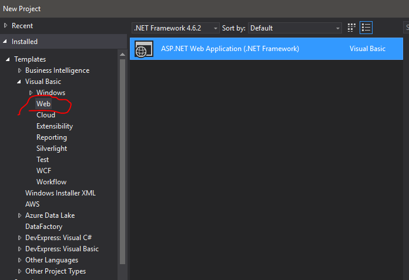
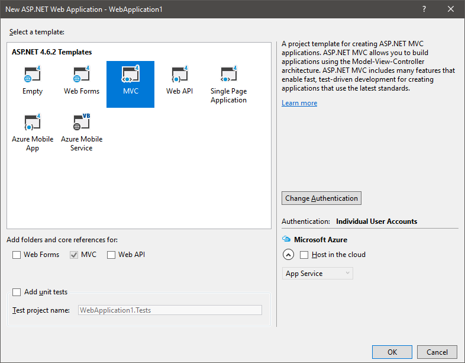

# Step By Step Guide

## Create Site See [Create site issue](https://github.com/VBDev2Dev/VBStore/pull/3)
1. Create ASP.Net MVC site    
1. Choose bootstrap theme and update bootstrap files with new css files.  I chose [Cyborg from bootswatch](https://bootswatch.com/cyborg/)
